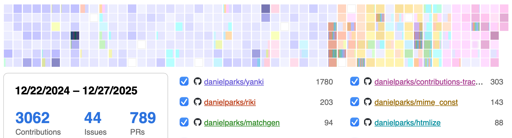

# Contributions Tracker

Displays a graph of the logged in user’s GitHub contributions ([demo],
[static demo]).

[][demo]

If the request is made to the frontend base URL, it will show the contributions
for the user currently logged into GitHub. If there is a username after the base
URL, it will show the contributions for that GitHub user.

## Modes

- **Authenticated.** This is the default mode that requires the user to be
  authenticated with GitHub in order to see data. Handled by [`index.html`]
  ([demo]).
- **Static.** The same interfaces as authenticated mode, but it loads the data
  from a file on the server (generated by [`scripts/generate-static.ts`]).
  Handled by [`static.html`] ([demo][static demo]).
- **Compact.** Suitable for embedding in another page. This just shows the
  contribution graph without the repository list or the pop-overs. Handled by
  [`compact.html`] ([demo][compact demo]).

## Configuration

Configuration of the frontend is via environment variables when running
`deno run dev` or `deno run build`:

- `VITE_GITHUB_CLIENT_ID`: The GitHub client ID for this app (from
  [GitHub OAuth app settings]).
- `VITE_FRONTEND_URL`: The app’s homepage (needs to match
  [GitHub OAuth app settings]).
- `VITE_BACKEND_URL`: Defaults to `$VITE_FRONTEND_URL`. This is the URL prefix
  for API calls, e.g. `$VITE_BACKEND_URL/api/health`. Note that the default
  backend (in [`backend/`]) does not support
  [Cross-Origin Resource Sharing][CORS], so usually this cannot reference a
  different host than `$VITE_FRONTEND_URL`. It doesn’t have to have a scheme and
  host specified, e.g. `/` is acceptable.
- `VITE_CONTRIBUTIONS_URL`: Defaults to `assets/contributions.json`. Compact and
  static modes load contributions data from this URL.
- `VITE_CLICK_URL`: If this is set, clicking the graph in compact mode will
  navigate to this URL.

For development, create a `.env` file (see [.env.example]) for convenience.

The backend takes configuration as command line parameters or environment
variables:

- `--bind IP:PORT` or `BIND`: the address and port to bind to.
- `--github-client-id STRING` or `GITHUB_CLIENT_ID`: The GitHub client ID for
  this app (from [GitHub OAuth app settings]).
- `--github-client-secret` or `GITHUB_CLIENT_SECRET`: The GitHub client secret
  for this app (from [GitHub OAuth app settings]).

The backend should be proxied through the frontend URL at `/api`, e.g. a request
to `http://frontend/api/health` should be proxied to
`http://backend/api/health`.

## Stack

This is a TypeScript and React app with a simple Rust backend built on
[Dropshot]. Dropshot provides automatic OpenAPI support, which enables
compile-time type checking of calls across the API boundary.

## To do

- [ ] Load information about local repositories in backend.

### Likely incompatible

- **Systemd socket activation.** Dropshot takes a `SocketAddr` as configuration
  then binds a `TcpListener`. In order to use [systemd socket activation], e.g.
  with [systemd_socket], we need to pass Dropshot an already bound
  `TcpListener`, or some sort of generic that supports
  `systemd_socket::SocketAddr`. This would require changes to Dropshot.

## Alternatives

There are lots of similar projects out there. A few of them:

- https://github.com/tsaitoh/concal
- https://github.com/fledra/contribmap
- https://github.com/yaolifeng0629/contribution-map
- https://github.com/ammsa/Githeat
- https://github.com/sallar/github-contributions-chart
- https://github.com/james-stoup/heatwave
- https://github.com/SeiwonPark/react-contribution-calendar
- https://sourceforge.net/projects/repoheat/

## License

Unless otherwise noted, this project is dual-licensed under the Apache 2 and MIT
licenses. You may choose to use either.

- [Apache License, Version 2.0](LICENSE-APACHE)
- [MIT license](LICENSE-MIT)

### Contributions

Unless you explicitly state otherwise, any contribution you submit as defined in
the Apache 2.0 license shall be dual licensed as above, without any additional
terms or conditions.

[demo]: https://demon.horse/portfolio/contributions-tracker/
[`index.html`]: index.html
[`scripts/generate-static.ts`]: scripts/generate-static.ts
[`static.html`]: static.html
[static demo]: https://demon.horse/portfolio/contributions-tracker/static.html
[`compact.html`]: compact.html
[compact demo]: https://demon.horse/portfolio/contributions-tracker/compact.html
[GitHub OAuth app settings]: https://github.com/settings/developers
[`backend/`]: backend
[CORS]: https://developer.mozilla.org/en-US/docs/Web/HTTP/Guides/CORS
[.env.example]: .env.example
[Dropshot]: https://docs.rs/dropshot/latest/dropshot/
[systemd socket activation]: https://www.freedesktop.org/software/systemd/man/latest/sd_listen_fds.html
[systemd_socket]: https://docs.rs/systemd_socket/latest/systemd_socket/
